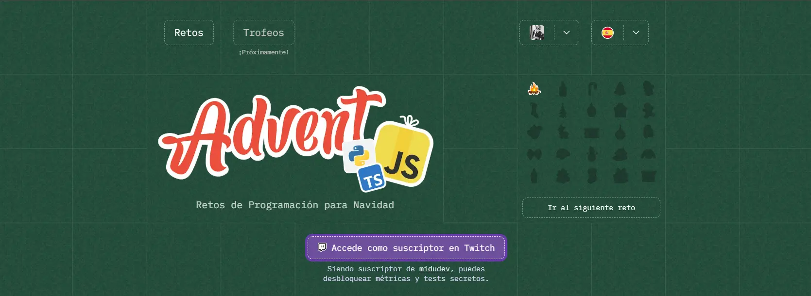

---

# AdventJS 2024 - Desafíos Diarios



## 🚀 Desafíos de JavaScript y Python

Este repositorio contiene las soluciones a los **desafíos diarios de AdventJS 2024**. Cada día, resolveremos un nuevo reto propuesto por **@midudev** para mejorar nuestras habilidades en **JavaScript** y **Python** durante el mes de diciembre. ¡Acompáñame en este viaje de aprendizaje y mejora continua!

[Lee mi blog sobre el desafío aquí](https://hebertdev.com/es/blog/resolviendo-los-desafios-dia-a-dia-del-adventjs-2024-mejorando-en-javascript)

[Visita la Web oficial de AdventJS 2024](https://adventjs.dev/es)

---

### 📅 Desafíos por Día

Cada día resuelvo un desafío utilizando **JavaScript** y **Python**. Los desafíos están organizados en carpetas correspondientes para cada lenguaje:

- **JavaScript**: Todos los archivos `.js` se encuentran en la carpeta [**javascript**](./javascript).
- **Python**: Todos los archivos `.py` se encuentran en la carpeta [**python**](./python).

---

### ⚡️ ¿Cómo correr los retos?

#### Para ejecutar los desafíos de JavaScript:

1. Clona el repositorio:

   ```bash
   git clone https://github.com/hebertdev/AdventJS-2024-Solutions.git
   cd AdventJS-2024-Solutions/javascript
   ```

2. Asegúrate de tener **Node.js** instalado. Puedes verificar la versión con:

   ```bash
   node -v
   ```

3. Corre el archivo del desafío correspondiente (por ejemplo, `day1.js`):

   ```bash
   node day1.js
   ```

#### Para ejecutar los desafíos de Python:

1. Clona el repositorio:

   ```bash
   git clone https://github.com/hebertdev/AdventJS-2024-Solutions.git
   cd AdventJS-2024-Solutions/python
   ```

2. Asegúrate de tener **Python 3** instalado. Puedes verificar la versión con:

   ```bash
   python3 --version
   ```

3. Corre el archivo del desafío correspondiente (por ejemplo, `day1.py`):

   ```bash
   python3 day1.py
   ```

---

### 🌟 Herramientas utilizadas

- **JavaScript (Node.js)**: Para la solución de los desafíos con JavaScript.
- **Python 3**: Para la solución de los desafíos con Python.

---

### 🎉 Agradecimientos

- **@midudev**: Por crear y compartir los desafíos diarios de AdventJS.
- **Comunidad de AdventJS**: Por motivar a seguir aprendiendo y mejorando nuestras habilidades.

---
